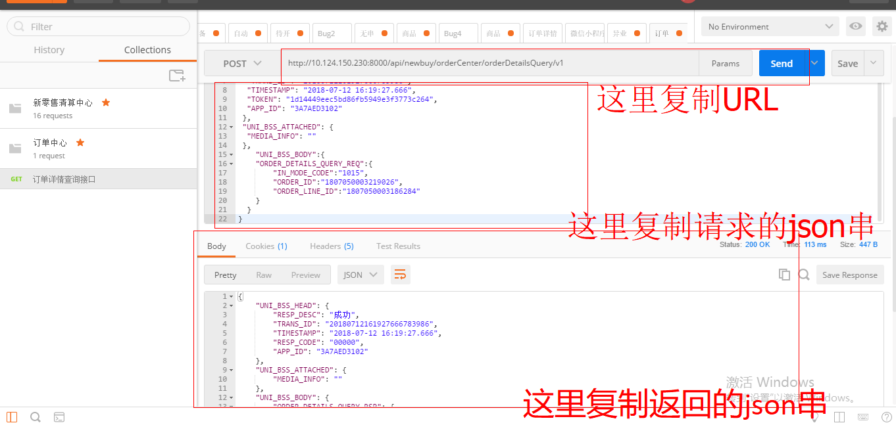
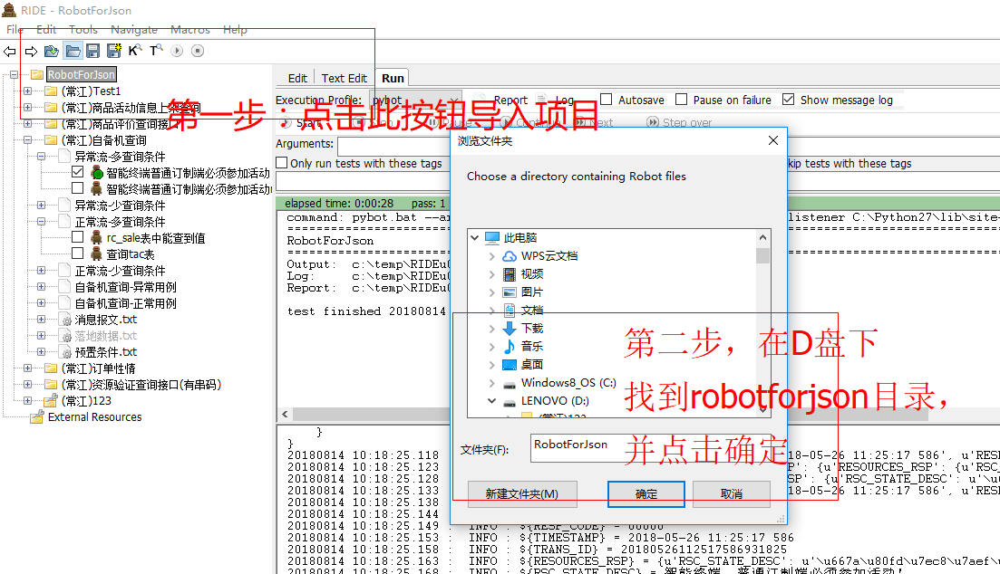

轮子分为两个部分，src目录下是源码，而json解析器公测版.exe是可执行的程序，对于开发者来讲，可以在idea中直接引入此项目，对于普通用户来讲，可以双击json解析器公测版.exe来直接运行

适用场景: 此轮子适用于直接生成robot脚本代码，即脚本自动来帮忙拼接json串，并转换成robot脚本语言，从而省去了人工拼接robot 内的json串的麻烦，提高了开发效率

使用指南: 开发者可以直接编译twoforjson来运行，而普通用户则可以双击json解析器公测版.exe来运行

注意，虽然src下面有一些可执行类，但是只有twoforjson类是源码！其他的类只是测试用的，使用指南如下：

轮子会在D:\\robotforjson目录下生成一个已经处理好的项目，此时用robot导入打包即可,之后建议导入项目后先跑测试用例，如果没有问题，那么根据json报文拼接robot脚本的目的已经完成了，如果有问题，请检查错误信息，这里给两点DEBUG建议

1.错误多发生于返回报文，可以对比robot下的请求报文和返回报文

2.如果碰到py文件不读的情况很有可能是py文件中有',",等特殊字符，请仔细检查

3.别忘了Star哦，滚动更新ing，GoodLuck！ :D